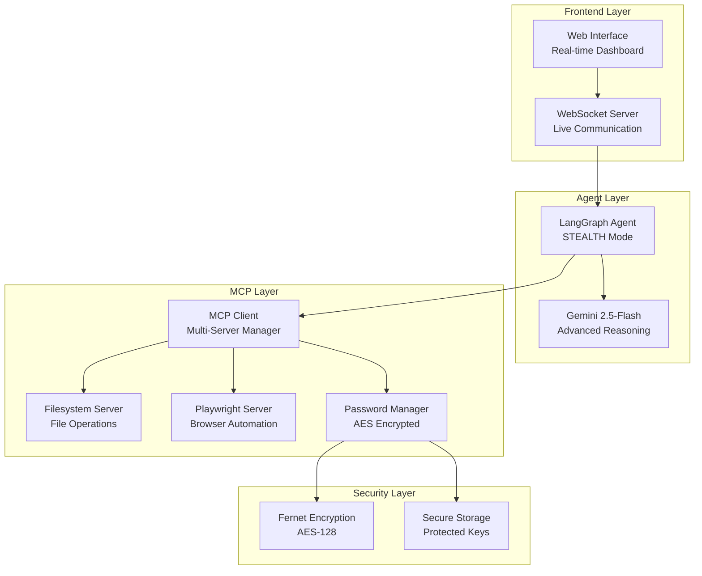

# ⚡ MCP Conductor Tools Demo

[](https://www.python.org/downloads/)
[](https://python-poetry.org/)
[](https://modelcontextprotocol.io/)
[](https://opensource.org/licenses/MIT)

> **Professional-grade Model Context Protocol (MCP) integration platform with multi-server orchestration, security-first password management, and privacy-focused execution modes.**

  

## 🎯 Overview

MCP Conductor Tools Demo is a comprehensive demonstration platform showcasing enterprise-ready integrations with the Model Context Protocol. Built for developers, researchers, and organizations looking to implement secure, scalable AI agent orchestration with real-world tooling capabilities.

### 🌟 Key Features

- **🔧 Multi-Server Architecture**: Seamless integration of filesystem, browser automation, and custom MCP servers
- **🔐 Enterprise Security**: Military-grade AES encryption for password management
- **🥷 STEALTH Mode**: Privacy-focused execution with hidden query details
- **🌐 Web Interface**: Professional browser-based control panel
- **🤖 LangGraph Integration**: Advanced agent orchestration with rich streaming
- **📱 Real-time Monitoring**: Live execution logs and server management

## 🏗️ Architecture



## 🚀 Quick Start

### Prerequisites

- **Python 3.11+**
- **Node.js 18+** (for Playwright MCP server)
- **Google API Key** (for Gemini integration)

### Installation

1. **Clone the repository**
   ```bash
   git clone https://github.com/feuji-ai/mcp-conductor-tools-demo.git
   cd mcp-conductor-tools-demo
   ```

2. **Install dependencies with Poetry**
   ```bash
   # Install Poetry if not already installed
   curl -sSL https://install.python-poetry.org | python3 -
   
   # Configure Poetry for in-project virtual environments
   poetry config virtualenvs.in-project true
   
   # Install project dependencies
   poetry install
   ```

3. **Install Node.js dependencies**
   ```bash
   npm install -g @playwright/mcp@latest
   ```

4. **Environment setup**
   ```bash
   # Create .env file
   cp .env.example .env
   
   # Add your Google API key
   echo "GOOGLE_API_KEY=your_api_key_here" >> .env
   ```

5. **Launch the demo**
   ```bash
   poetry run python Demo/run_demo.py
   ```

The demo will automatically:
- Start HTTP server on `http://localhost:8080`
- Launch WebSocket backend on `ws://localhost:8765`
- Open your browser to the control panel

## 💼 Enterprise Features

### 🔐 Password Management Server

Our custom MCP server provides enterprise-grade password management:

```python
# Quick setup
from Custom import setup_password_server
setup_password_server()

# Advanced configuration
from Client import add_custom_server
add_custom_server(
    name="password_manager",
    command="python",
    args=["Custom/password_server.py"],
    description="AES-encrypted password management"
)
```

**Security Features:**
- **AES-128 Fernet encryption** for password storage
- **Secure key management** with proper file permissions
- **Metadata support** for usernames, URLs, and notes
- **Audit trail** with creation and modification timestamps

### 🥷 STEALTH Mode Execution

Privacy-focused execution mode for sensitive operations:

```python
agent = LangGraphAgent(
    llm=llm,
    client=client,
    stream_display_mode=StreamDisplayMode.STEALTH,  # 🥷 Privacy mode
    auto_print_streaming=False
)
```

**Privacy Benefits:**
- Query details hidden from display
- Execution steps logged separately
- Sensitive data protection
- Professional presentation mode

### 🌐 Browser Automation

Integrated Playwright server for web automation:

```bash
# Example: E-commerce data extraction
"Navigate to https://saucedemo.com and extract product catalog as JSON"

# Example: Form automation
"Fill out the contact form with provided details and submit"
```

## 📚 Usage Examples

### Basic Multi-Server Setup

```python
from Client import create_multi_server_client
from Agent import get_multi_server_agent

# Configure servers
client = create_multi_server_client({
    "filesystem": True,
    "playwright": True,
    "password_manager": True
})

# Create agent
agent = get_multi_server_agent(client)

# Execute complex workflows
await agent.run("Read instructions.txt and automate the specified web task")
```

### Password Management Workflow

```python
# Generate secure passwords
await agent.run("Generate a 20-character password with symbols")

# Store credentials securely
await agent.run("""
Save credentials for GitHub:
- Username: developer@company.com
- Password: [generated-password]
- URL: https://github.com
- Notes: Development environment access
""")

# Retrieve when needed
await agent.run("Get the GitHub password for deployment")
```

### Web Automation Pipeline

```python
# Complete e-commerce automation
workflow = """
1. Navigate to the e-commerce site
2. Login with stored credentials
3. Extract product catalog
4. Save results as structured JSON
5. Generate summary report
"""

result = await agent.run(workflow)
```

## 🔧 Configuration

### Server Management

```python
from Client import get_server_manager

manager = get_server_manager()

# List available servers
servers = manager.list_servers_for_selection()

# Enable/disable servers
manager.enable_server("password_manager")
manager.disable_server("playwright")

# Add custom servers
manager.add_custom_server(
    name="custom_api",
    command="python",
    args=["-m", "my_custom_server"],
    description="Custom API integration"
)
```

### Advanced Agent Configuration

```python
from mcp_conductor import LangGraphAgent, StreamDisplayMode

agent = LangGraphAgent(
    llm=get_gemini_llm(),
    client=client,
    max_steps=100,                              # Execution limits
    stream_display_mode=StreamDisplayMode.RICH, # Display mode
    memory_enabled=True,                        # Conversation memory
    verbose=True                               # Detailed logging
)
```

## 🧪 Testing & Examples

### Run Example Workflows

```bash
# Multi-server filesystem + browser automation
poetry run python Test/example.py

# Password management demonstration
poetry run python Test/password_example.py

# Math tools with LangChain integration
poetry run python Test/Tools/agent_demo.py
```

### Web Interface Testing

1. Open `http://localhost:8080`
2. Click "🚀 Start Agent"
3. Try these commands:
   - `"Generate a secure password and save it for GitHub"`
   - `"Navigate to saucedemo.com and extract product data"`
   - `"Read Test/Example/instructions.txt and execute the task"`

## 📖 API Reference

### Core Components

| Component | Description | Key Methods |
|-----------|-------------|-------------|
| `MCPServerManager` | Server lifecycle management | `add_custom_server()`, `enable_server()` |
| `LangGraphAgent` | AI agent orchestration | `run()`, `stream()`, `initialize()` |
| `PasswordServer` | Encrypted credential storage | `save_password()`, `get_password()` |

### Environment Variables

| Variable | Description | Required |
|----------|-------------|----------|
| `GOOGLE_API_KEY` | Google Gemini API access | ✅ Yes |
| `MCP_SERVER_TIMEOUT` | Server connection timeout | ❌ Optional |
| `LOG_LEVEL` | Application logging level | ❌ Optional |

## 🛡️ Security Considerations

- **Encryption**: All passwords encrypted with Fernet (AES-128)
- **Storage**: Secure file permissions (`0o600`) for sensitive data
- **Network**: Local-only WebSocket connections by default
- **Memory**: Sensitive data cleared from memory after use
- **Audit**: All operations logged with timestamps

## 🤝 Contributing

We welcome contributions! Please see our [Contributing Guidelines](CONTRIBUTING.md).

1. Fork the repository
2. Create a feature branch: `git checkout -b feature/amazing-feature`
3. Commit changes: `git commit -m 'Add amazing feature'`
4. Push to branch: `git push origin feature/amazing-feature`
5. Open a Pull Request

### Development Setup

```bash
# Clone and setup development environment
git clone https://github.com/feuji-ai/mcp-conductor-tools-demo.git
cd mcp-conductor-tools-demo

# Install with development dependencies
poetry install --with dev

# Run tests
poetry run pytest

# Code formatting
poetry run black .
poetry run isort .
```

## 📄 License

This project is licensed under the MIT License - see the [LICENSE](LICENSE) file for details.

## 🙋‍♂️ Support & Community

- **Issues**: [GitHub Issues](https://github.com/feuji-ai/mcp-conductor-tools-demo/issues)
- **Discussions**: [GitHub Discussions](https://github.com/feuji-ai/mcp-conductor-tools-demo/discussions)
- **Documentation**: [Full Documentation](https://docs.feuji.ai/mcp-conductor)
- **Enterprise Support**: [Contact Us](mailto:support@feuji.ai)

## 🏢 About FEUJI AI

FEUJI AI specializes in enterprise AI solutions and model orchestration platforms. Visit us at [feuji.ai](https://feuji.ai) for more innovative AI tools and services.

---

<div align="center">

**⭐ Star this repository if it helped you!**

[Report Bug](https://github.com/feuji-ai/mcp-conductor-tools-demo/issues) • [Request Feature](https://github.com/feuji-ai/mcp-conductor-tools-demo/issues) • [Documentation](https://docs.feuji.ai)

</div>